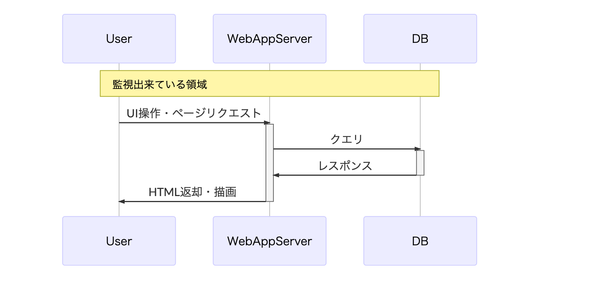
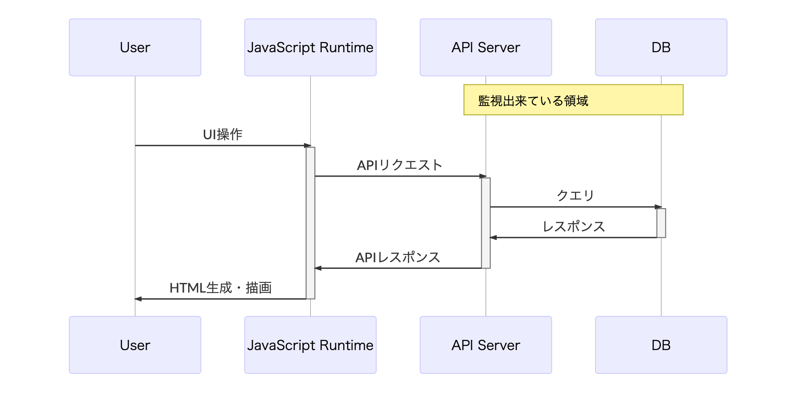

## 2019年5月, Firebase performance for Webが発表 :tada:

https://firebase.googleblog.com/2019/05/whats-new-Google-IO-2019.html

> web developers can understand how real users are experiencing their app in the wild.

---

## 監視してますか？

「入門 監視」より

> まず監視を追加すべきなのは、ユーザがあなたのアプリケーションとやり取りをするところです。
> Apacheのノードが何代動いているか、ジョブに対していくつのワーカが使用可能かといったアプリケーションの実装の詳細をユーザは気にしません。

---

## MPA時代のクライアント・サーバモデルと、監視構成図

- ユーザ領域で起こるのはHTMLによる描画処理のみ。
- 描画パフォーマンスはブラウザのHTML解釈速度にのみ依存
- アプリケーション開発者はブラウザでの描画速度について責任がない

---

## SPA時代のクライアント・サーバモデルと、監視の実情(図)

- ユーザ領域ではHTMLによる(初期)描画処理に加えて、ユーザ操作を起点としたHTML再生成処理が頻繁に発生する。
- パフォーマンスはブラウザの描画処理に加えて、HTML再生成処理に大きく依存する
- アプリケーション開発者はブラウザでの描画速度に責任がある

---

## パフォーマンス監視のアプローチ

どちらかだけでは不完全

- Real User Monitoring
  - GoogleAnalytics
  - LogRocket
  - NewRelicBrowser
- Synthetic Monitoring
  - WebPageTest
  - LightHouse

---

## Real User Monitoring

選択肢が少なく、満足出来るものがない

- GoogleAnalytics
  - パフォーマンス計測のためのツールではない
  - 必要なメトリクスはほぼ全て自分で送信する必要がある
- LogRocket
  - パフォーマンス計測のためのツールではない
  - パフォーマンス系のメトリクスを一覧出来ない
- NewRelicBrowser
  - SPA時代に対応出来ていない
  - LoadとPaintの区別がない
  - API通信が有料(Paintとの関連付けもない?)

---

## First Meaningful Paint

https://developers.google.com/web/tools/lighthouse/audits/first-meaningful-paint

> Page load is a key aspect of how a user perceives the performance of your page

- 最初の「意味のある」描画
- 最低限、ここが計測できないとしょうがない

---

## RAILによるパフォーマンス影響要因のモデル化

https://developers.google.com/web/fundamentals/performance/rail

> RAIL is a user-centric performance model that breaks down the user's experience into key actions.

- Response(50ms以下で反応する)
- Animation(10msを1frameに)
- Idle(ユーザ操作受付時間はなるべく長く)
- Load(操作可能になるまで、3G且つモバイル端末で5s)

---

## @4月中旬

- 必要なはずなのに選択肢がない
- 作ってみたら需要があるのでは
- 最近個人でWebサービスを作ってない

#### Let's get started :point_right: https://github.com/kogai/bperf

---

## ゴールデンウィークにパフォーマンス監視ツールを作るぞ！

:fire: :fire: :fire:

---

## 走り出すまえに

- 個人開発で一番大事なのはマイルストーンの設置と達成
- 自分のやる気だけが頼りなので、最大限スポイルしないように動く
- コストの高いこと・面倒なことは細かく前倒しで片付けていく
  - 調査
  - 考察
  - 開発環境の構築
  - CIの整備

---

## PoC

パフォーマンスの監視のためのAPI

- [PerformanceObserver](https://developer.mozilla.org/en-US/docs/Web/API/PerformanceObserver)
- [MutationObserver](https://developer.mozilla.org/en-US/docs/Web/API/MutationObserver)

[ゴールデンウィーク前に、計測が出来ること](https://github.com/kogai/bperf/commit/eb4a61c4cc93b4c116f577f787f46eaead10aa81)までは分かった。

---

## 開発環境

残りはWebサービスの体裁を作れば良い。
新しい言語に手を出すのが目的ではないので書けるもの中から選ぶ。

- Go(人口がそれなりに多い、安全ではないものの静的型検査できる)
- TypeScript(最もシンプルなブラウザアプリ開発言語)

---

## Webサービスの体裁？

- セッション管理する
- どこかにメトリクスを保存する
- メトリクスをチャートに描画する

をゴールにした

---

## Misc

- 開発体制はインクリメンタルに改善していく
- 最初にしっかり土台を作ると必ず頓挫する(自分調べ)
- テストどころかコードもろくにないのにCI構築に時間を掛けない
- ランタイムのバージョンは固定しない
- 将来困るかも? -> 困れば良い。受け入れる。

---

## TypeScript?

新しい言語に手を出すのが目的ではないと言いつつ、TypeScriptで開発を始めると

- 型システムの健全性(と高いレベルの完全性)の欠如
- 標準ライブラリの欠如
- Mutable/Immutableの混合

といった要素がリソースを摩耗しだす
「これは平日の昼間にやっているやつでは？」

---

## TypeScript -> ?

- 個人開発の一番良いところは、自分の能力以外に制約がないところ
- 課題に対する妥当性すらなくて良い
  - 例: [JSエコシステムのためのライブラリをOCamlで書く](https://github.com/kogai/typed_i18n)
  - 例: [シェルで良いものをRustで書く](https://github.com/kogai/trs)

---

## TypeScript -> Elm

---

## Elm!

- 型システムが健全(かつ完全?)
- 標準ライブラリがある
- Immutable

---

## 健全性と完全性について

野矢茂樹「論理学」より

> 命題論理の公理系LPの無矛盾性

> (1) 定理はすべて論理的真理である

> (2) 論理的真理のすべてが定理として証明されうる

1が健全性、2が完全性とのこと

---

## 健全性と完全性について(プログラマ視点)

https://soutaro.hatenablog.com/entry/20080319/1205944749

> 「型推論が健全性を持っている」というのは，「型が推論できたら，そのプログラムは正しい」ということ

> 「型推論が完全性を持っている」というのは，「正しいプログラムは必ず型が推論できる」ということ

カリー・ハワード同型対応(型検査が通れば型定義の正しさは証明されたと見なしてよい、みたいなこと)から、

- 定理はすべて論理的真理である
  - -> 型定義・型制約が正しいのであれば、正しい(定理=型同士に矛盾のない)プログラムである
- 論理的真理のすべてが定理として証明されうる
  - -> 正しいプログラムは（注釈せずとも何らかの形の）型定義・型制約(=定理)を持ちうる

という風に理解している。(公理が言語組み込みの型、定理がプログラマが定義した型、というイメージ)

Elmで書いたコードは、TypeScriptのそれに比べて「値の種類からくる矛盾が存在しない」且つ「ほとんどのケースで型注釈が不要」ということ。

---

## アーキテクチャ

とやっていると、だんだんサービスの構成要素が見えてきた

- 計測スクリプト(ユーザ環境でメトリクスを収集する。エージェント。)
- APIサーバ(計測したメトリクスを保存、ダッシュボードへ開放する)
- ダッシュボード(計測したメトリクスを閲覧する)

これらは全て別々の環境で動く、目的も違う(ついでに開発言語も違う)
`beacon`, `api`, `web` の3パーツに分けて、段々動くようになってきた。

---

## Apiの構成

大体一般的なMVCっぽいディレクトリ構成。 :point_down: を使った

- Gin
  - WAF
  - 素のhttpパッケージで充分という意見もある
  - とは言えルーティングのボイラープレートやプラグイン管理くらいは外注したい
- Gorm
  - ORM
  - Goらしく薄め。少し複雑なクエリを書こうとすると、生のSQLを書く必要がある

---

## Webの構成

- Elmの記事ではMVVMが1枚のファイルに収まった規模のもので紹介されていることが多い
- 当然Real worldではそのサイズには収まらない（それくらいなら生DOM APIで充分）
- 画面数枚・APIリクエストあり・時間(`作用`)表現ありのところまでは作ったので、動くものを作る上で必要なところはおよそ踏めたと思う
- 純粋関数型言語(多分)なので、基本的に`作用`はプログラムのトップレベルで管理する
- 公式ではないけど、[Elm作者を擁する会社の提唱するサンプル構成](https://github.com/rtfeldman/elm-spa-example)

---

## Elmのディレクトリ構成

別にここから始める必要はない。`app.elm`から始めて、コードの増加に沿ってディレクトリに分ければ良い。

- Model
  - Authモデルのコードがわかりやすいかも
  - ReduxのStore/Actionと対応していると考えて間違いではない
- Page
  - ViewModel, Controllerに近いものと思って良い
  - Modelとの棲み分けが重要(あくまでViewとの接続のための状態管理)
- View
  - JSX記法を排除しているので読みやすい(というか、仮想DOMの生成関数に過ぎないという事実が明確になる)
  - style, css-classなども静的に型付けされていて、変更に強い
  - 何らかの作用を持つというコンテキストを含んだ仮想DOMとして定義される(`Html msg`, msgは型変数)
- Api
  - デコーダとレスポンスの型による、静的・動的型検査(漸進的型付けではないので、動的型検査も言語の中に組み込めみやすい)
  - headerなどもある程度静的に型検査される
  - フォームのバリデーションをデータモデルのデコーダとして捉えているライブラリがあって面白かった

---

## 純粋性からくる注意点

- HTTPリクエスト、ファイルアクセス、時間、ランダム性、ランタイムへのイベントキューイングなど、全て外部世界の作用
- 狭く見ると、現在時刻を取得するだけでやたら手間が掛かるように見えるかも
- 大抵元は取れる

---

## デモ

---

## その後

- 大体動いたし、そろそろどこでサービス展開するか考えるか
- ログをDBに直で保存するとコストやばそうだから、その前に別の基盤に移すか。Hadoopとか?よく知らないけど
- チャートもデータビジュアライゼーションの本を参考にきちんと設計するぞ
-  :fire: :fire: :fire: やるぞ  :fire: :fire: :fire:

---

## 2019年5月, Firebase performance for Webが発表 :tada:

https://firebase.googleblog.com/2019/05/whats-new-Google-IO-2019.html

> web developers can understand how real users are experiencing their app in the wild.

---

## 完。

---

## まとめ

- 自分のやる気という最重要リソースの管理
- Elm&GoでのWeb開発、過不足なくて良い
- 個人開発で選んだテーマをそのまま解決するサービス・ツールが途中で出てくることはとてもよくある
- 捨てたものでも、ある程度手を掛けたものならこうやって再利用出来る(言い訳)

---

## 参考

- [Google Developers](https://developers.google.com/web/fundamentals/performance/rail)
- [An Introduction to Elm](https://guide.elm-lang.org/)
- [入門 監視](https://amzn.to/34CwLK3)
- [論理学](https://amzn.to/2HYq4IA)
- [基礎からわかる Elm](https://amzn.to/2UGUep4)
- [Webフロントエンド ハイパフォーマンス チューニング](https://amzn.to/31mhwmo)
- [ハイパフォーマンス ブラウザネットワーキング ―ネットワークアプリケーションのためのパフォーマンス最適化](https://amzn.to/31cjJRo)
- [The Go Programming Language](https://amzn.to/2UNyrfh)
- [Go Programming Blueprints](https://amzn.to/2ZNYO9P)
- [プログラミング言語Goフレーズブック](https://amzn.to/2Ln4y2u)
- [Third-Party JavaScript](https://amzn.to/2NQ01qV)
